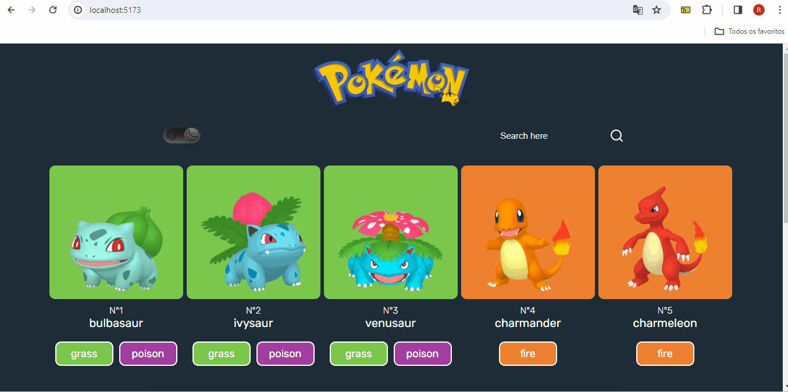

# Pokedex

## Descrição
    Esse é um projeto de uma pokedex usando REACT, single-page application (SPA).


## Funcionalidades
- Alterna tema em claro/light ou escuro/dark.
- Um input que filtra os pokemons pelo seu nome ou pelo seu tipo.
- Ao clicar em um pokemon apresenta as suas informações detalhadas como moves e abilities.

## Tecnologias

- Styled Components: Estilizar os componentes sem um arquivo css.
- React Router: Usada para facilitar a navegação dentro da aplicação.
- PokeAPI: Usada para buscar os pokemons.
- Axios: Foi usado para buscar os dados ao invés do Fetch.
- Context API: Para a criação de uma função que alterna o tema do projeto.

## Gifs

### Navegação, alternando tema e filtragem


### Infos do Pokemon


## Como utilizar

### clone do projeto
```
    git clone https://github.com/Ryanvrl/pokedex-react.git
```

### Acessar a pasta
```
    cd "projeto"
```

### Instalação
```
    npm install
```

### Começar
```
    npm start
```

